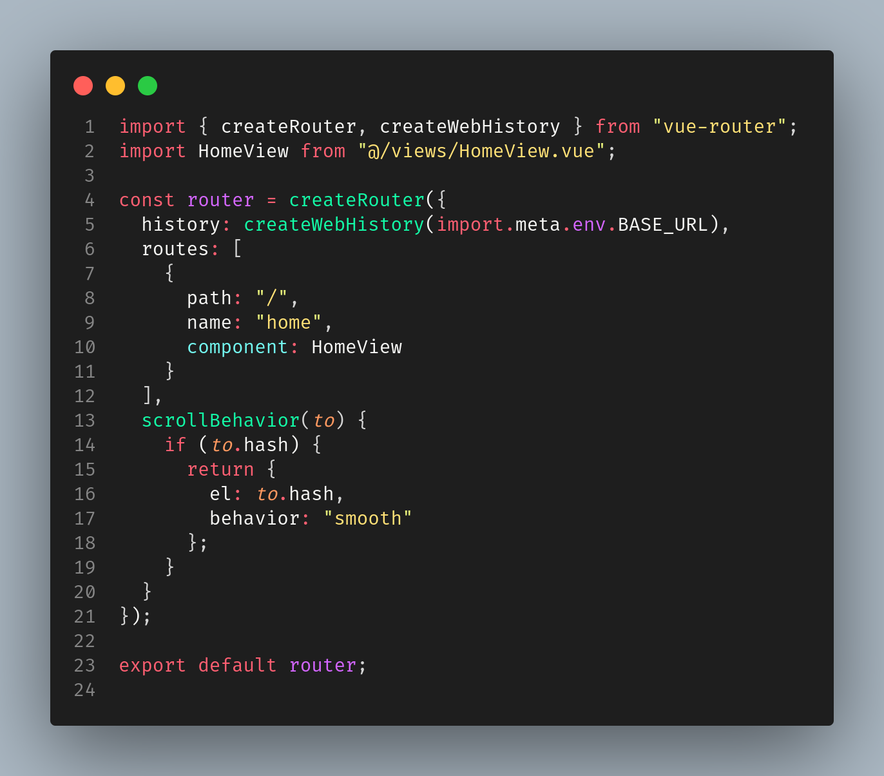

# Northeirn Theme

Northeirn is a visually pleasing and soft theme for Visual Studio Code, carefully crafted with love and attention to detail.

## Installation

1. Install the theme from the [Visual Studio Code Marketplace](https://marketplace.visualstudio.com/items?itemName=murilonicemento.northeirn).

## Features

- **Beautiful Color Palette:** Northeirn uses a soothing color scheme with primary colors:
  -  `#1e1e1e`
  -  `#f8f8f2`
  -  `#ff4b61`
  -  `#ff9960`
  -  `#ffe176`
  -  `#73f9f1`
  -  `#13fba7`
  -  `#d466ff`

- **Eye-Catching Logo:** Check out our stylish logo that perfectly represents the Northeirn vibe.

## How to Contribute

If you want to contribute to Northeirn, feel free to fork the repository and submit your pull requests. We welcome any suggestions or bug reports!

## License

This theme is licensed under the [MIT License](LICENSE).
